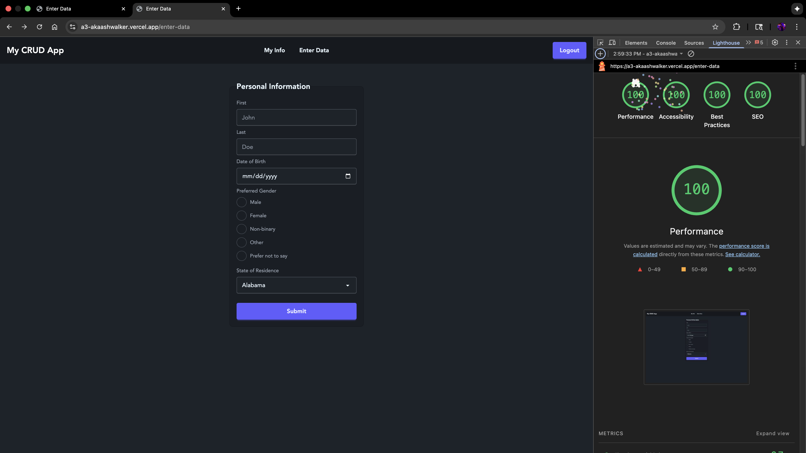
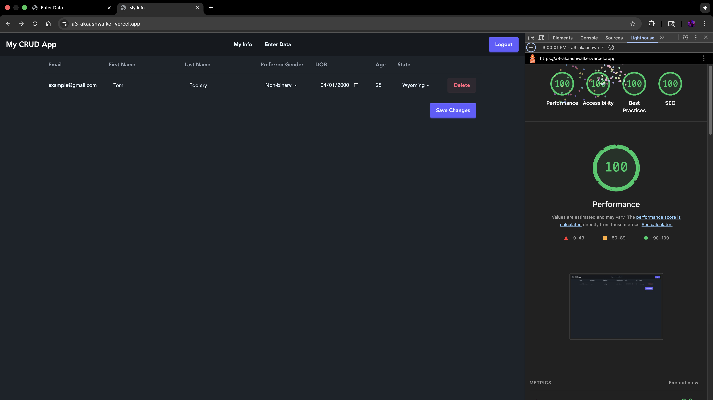

## My CRUD App

### Important Info
Username: `example@gmail.com`\
Password: `Password123`\
Website link (frontend): https://a3-persistence-a25.vercel.app/ \
Backend link (Express server): https://a3-akaashwalker.onrender.com/ \
GitHub link: https://github.com/Akaash-Walker/a3-persistence-a25 \
**Note 1:** I used pnpm as the package manager for this project. From the testing that I've done, npm _should_ work. Just thought I'd mention it in case there are any issues.
**Note 2:** The backend needs some time to warm up when the first request is made. Normally Render immediately spins up the server when you visit a page, but since the frontend is hosted on Vercel, the first request to the backend takes a bit longer. After the first request is made, subsequent requests should be significantly faster. Note again that this is only because I'm using the free tier of Render. 

### Summary
* the goal of the application is to allow users to store and modify their personal information such as their name, date of birth, preferred gender, and state of residence.
* Some of the challenges I faced:
  * Implementing OAuth authentication with the NextJS
  * Deploying the application on Vercel (Vercel is a serverless platform, which made it challenging to use with express, read more in the Achievements section)
  * Managing routing using NextJS's file-based routing system alongside Express routing
  * Rendering dynamic content while also using SSR (I've only used CSR in the past)
* Authentication method used: OAuth with Auth0
  * I chose to use Auth0 because I've used it in the past and also provided some bonus points for doing so. I also figured that the implementation would be fairly straightforward since I'm using NextJS. More about my experience with Auth0 in the Achievements section.
* CSS framework used: Tailwind CSS with DaisyUI components
  * I chose to use Tailwind since it allows me to quickly add styling, while DaisyUI provides pre-built components that are easy to customize.
* Express middleware used:
  * `auth0/nextjs-auth0` for OAuth authentication
  * `mongoose` for MongoDB object modeling
  * CORS middleware to handle cross-origin requests between NextJS frontend and Express backend

## Baseline Requirements
- **Server**: (15 points) Implemented using Express, handling routes for user authentication and CRUD operations.
- **Results Functionality**: (10 points) Displays all data associated with the logged-in user, excluding sensitive information like passwords (Auth0 handles this).
- **Form/Entry Functionality**: (15 points) Users can add, modify, and delete their personal information through a form interface. Some fields cannot be modified after initial entry (email since it is used with Auth0).
- **Persistent Data Storage**: (15 points) Utilized MongoDB Atlas for cloud-based database storage, with Mongoose for schema definition and data interaction.
- **CSS Framework**: (10 points) Used Tailwind CSS with DaisyUI components for styling, ensuring a modern and responsive design.

### HTML
- (5 points) Used various input types including text fields, date pickers, radio buttons, and dropdowns to capture user information.
- Displayed data is specific to the logged-in user.

### CSS
- DaisyUI components make up the bulk of the styling, with some minor customizations using Tailwind CSS for things such as padding.
- A sans-serif font (Avenir) from Adobe Fonts was used for a readable and modern look.

### JavaScript
- JS used to make collect form data, make post request, and also fetch user data from the db to display.

### Node.js
- Express server handles api routes and connects to MongoDB for data persistence.

### General
- (10 points) Achieved  ninety percent or higher in all four Lighthouse categories for each page(Performance, Best Practices, Accessibility, and SEO).
- **!!! Add Screenshots !!!**

## Achievements

### Technical Achievements

#### Achievement 1: OAuth Authentication with Auth0 (10 points)
**Dummy Account Info** \
Username: `example@gmail.com` \
Password: `Password123`
- I implemented Auth0 authentication using the `@auth0/nextjs-auth0` library. This was challenging because the [Auth0 quickstart](https://auth0.com/docs/quickstart/webapp/nextjs/01-login) integration wasn't entirely descriptive, whereas the [GitHub](https://github.com/auth0/nextjs-auth0) page had a lot more detail. Once I found this GitHub page, it made the implementation much easier.

#### Achievement 2: Next.js with Express (Asking 5 points)
- I used Next.js's file-based routing system alongside Express routing. Next.js handles the frontend routing, while Express handles the backend API routes. This proved to be challenging when trying to deploy to vercel, as express is a long-running process. The preferable solution would have been to just use the Next.js API routes, but this assignment required the use of Express. Personally I have nothing wrong with Express, and I do actually like it, but I definitely would not have chosen to use NextJS if I had known that it would not play nice with Express. 
- I implemented (some) server-side rendering (SSR) using Next.js. This was a new to me, as I have only ever used client-side rendering (CSR) with React in the past. Not being able to use React hooks made it a bit challenging, but I was able to figure it out with some research. Many of the examples I saw online brought the db connection logic into the component file, but I instead used the "use server" directive to make get and post requests using axios. 

#### Achievement 3: Alternative deployment on Vercel (5 points)
- I deployed the application on Vercel. This proved to be a massive headache because Vercel is serverless. I wanted to use Vercel because it's supposed to have a really easy deployment with Next.js, but due to the Express requirement, it made things much more difficult. I used a 2 pronged approach, where I hosted the frontend on Vercel and the backend on Render. This worked, but it was not ideal. I had to use CORS middleware to handle cross-origin requests between the frontend and backend, which added complexity. It also means I had to write custom deployment scripts so that each platform would have the correct code. Overall, it was a good learning experience, but I understand why it's just recommended to use the Next.js API routes. Not sure if I can count this as a technical achievement, but if so it should be worth at least 5 points.

#### Achievement 4: 100% Lighthouse Scores (5 points)
- I achieved 100% in all four Lighthouse categories (Performance, Best Practices, Accessibility, and SEO) for both pages of my application. This proved challenging since Adobe fonts cannot be hosted locally for faster load times. I was able to achieve this by preloading the font in the head of my document.

### Design/Evaluation Achievements
(10 points) I followed the w3 org accessibility tips for writing, designing, and developing. Here are a list of 12 specific tips I followed:

#### Writing
1. Provide clear instructions: The form the user inputs data into has clear instructions on what information is required. The "Enter data" page has examples of valid inputs for each field. It also indicates errors when the user inputs invalid data (i.e if the user puts in a non-valid email address).
2. Unique page titles: Each page has a unique title that reflects the currently navigated page. For example, the info page is titled "My Info", while the data input page is titled "Enter Data".
3. Use of headings and subheadings: The application uses headings and subheadings to organize input fields. For example, the "Enter Data" page has a main heading and subheadings for each section of the form.
4. Keep content clear and consist: Simple language and formatting is used throughout the application. For example, rather than instructions on what data to input, the form has labels that guide the user at each step. In addition to this, the user's data is displayed in a table, which helps to organize and present the information clearly.

#### Designing
1. Provide sufficient contrast between foreground and background: My application uses a high contrast color scheme, which is either white text on a dark gray background (darkmode users) or black text on a white background (lightmode users). Less contrast is used for placeholder information, such as in the input fields.
2. Color alone isn't used to convey information: I use color and descriptive buttons to convey information. DaisyUI provides a variety of button styles, one of which is a red button for destructive actions (i.e deleting data). Not only is the button red, but it also has the text "Delete" on it to further indicate its purpose.
3. Ensure that interactive elements are easy to identify: Input fields have a strong border around them when focused, making it easy to identify which field the user is currently interacting with. Buttons also follow this patten, with a strong border when selected. This should help users who navigate the site using a keyboard rather than a mouse.
4. Form elements have associated labels: Each input field has a label that describes what information is required. For example, the email input field has a label "Email", while the date of birth field has a label "Date of Birth". Labels are positioned above the input fields to ensure they are easily associated with the correct field. Radio buttons break this pattern, with the label positioned to the right of the button.

#### Developing
1. Identify page language and language changes: layout.tsx has a `<html lang="en">` tag, which indicates that the page is in English. Since layout.tsx is the root component, this tag should be inherited by all other components.
2. Code reflects reading order: Much of the code is structured to reflect the reading order of the page. For example, personalinfo.tsx is the component on /enter-data that allows users to input their personal information. The code is broken down into 3 main sections: hooks, helper function, and the HTML return. To make the code easier to read, the variable order is kept consistent within all three sections. For example, the hooks are in the order of first name, last name, date of birth, email, preferred gender, and state. This same order is kept when making the post request in the helper function `handleSubmit`, as well as in the HTML return where the input fields are rendered.
3. Associate a label with each form control: Each input has a corresponding label for the form on the /enter-data page. This should allow screen readers to properly associate the label with the input field.
4. Code that adapts to the user's technology: I added mobile responsiveness to the application using Tailwind CSS's responsive design utilities. For example, the navbar hides the app name on small screens to save space, while the data table on the /my-info page becomes a series of cards on smaller screens to make it easily scrollable.

### CRAP Principles

(5 points) I wrote some info about how I implemented the CRAP principles in my application.

**Contrast**

To give my application the best contrast, I used a variety of design patterns to make the content stand out. For example, the font size varies between different elements on the page, with headings being larger than body text. The website uses DaisyUI's built-in color schemes, which provide good contrast between text and background colors. This includes both light and dark modes. I used a sans-serif font (Avenir) from Adobe Fonts for a clean and modern look. I chose this font because it is easy to read on both desktop and mobile devices. Buttons and input fields have distinct shapes that make them easily identifiable.
Important elements such as buttons and headings are emphasized using larger font sizes and bright colors. Using all of these techniques allowed me to deliver a professional looking application without the hassle of developing a lot of things from scratch.

**Repetition**

Using repeated elements can help bring a sense of uniformity and familiarity to the user when using your application. Some examples of repeated components are the navbar, buttons, colors, and on mobile, the card layout for displaying user data. This was important to me as component design is a large part of React, especially with how much time and work it saves you. Being able to create a reusable, modifiable component allowed me to have a consistent and uniform feel throughout my application, even when things needed design tweaks. Along with this, DaisyUI’s color palate did a lot of the heavy lifting for me, as all of the pre-built components had the same theme and colors. With the power of a CSS framework and React, I was able to easily bring repeatable elements throughout my application.

**Alignment**

Alignment was something I put a lot of consideration into, especially since I made the website mobile responsive. Because of this, most elements are center aligned. This makes it much easier to fit a lot of information in, such as with tables and forms. I did make sure though that some elements remained right aligned, such as buttons. This provided a clear and understandable flow of content, as information was displayed on the left with available actions (such as delete in the “my-info” page) on the right. Center aligning things also gave me a lot of negative space, which helps to make the application feel less cluttered and easier to navigate. This can be seen in the navbar, where the tabs are center aligned to make it easy to see what available pages there are (even though there are only 2).

**Proximity**

Information is grouped together based on its relevance. I made sure to put some thought into the layout of the /enter-data page, such as the order of the input fields. For example, the first and last name fields are next to each other since they are closely related. The date of birth field is below these two fields, as it is also personal information but not as closely related. Next, I have preferred gender since it is also personal information. Finally, I have the state field, which is less personal information and more location based. Not only is this seen on the input forms, but this is also seen on the “my-info” page where information is grouped just as it was on the “enter-data” page, albeit with some additional fields.

## Additional Libraries/Frameworks Used
Here is a list of additional libraries used (as seen in package.json):
- `auth0/nextjs-auth0` for OAuth authentication
- `axios` for making HTTP requests from the frontend to the backend
- `concurrently` for running both the NextJS frontend and Express backend simultaneously during development
- `cors` for handling cross-origin requests between the frontend and backend
- `daisyui` for pre-built Tailwind CSS components
- `dotenv` for managing environment variables
- `express` for the backend server
- `mongodb` for the database
- `mongoose` for MongoDB object modeling
- `next` for the React framework
- `nodemon` for automatically restarting the server during development
- `react` for building the user interface
- `react-dom` for rendering React components in the DOM
- `ts-node` for running TypeScript files directly

